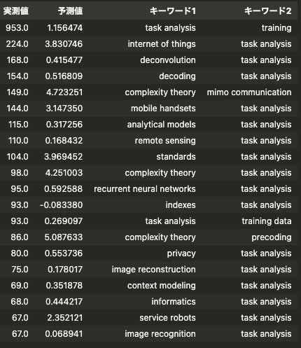

# 研究の今後の進め方

現段階で、セマンティックネットワークを構築し、そのモデルを学習・予測・評価を行うことができた。次のステップとして、どのように研究を進めていくかについて、まとめる。

## 現状の結果

前回までに、未来5年の二つのトピックを共立した論文数を、線形回帰やLightGBMなどをもちいて予測を行った。なので、より難しい問題設定、これまでに出てきたことないペアが、5年以内に何回現れるかを予測することを行った。

1. 類似度が高いキーワードを省いた場合の予測
1. これまでに出てきたことないペアが、5年以内に何回現れるかの予測

この二つの予測を行った。

1の予測は、類似度の高いキーワードを省かない場合と比べて、若干低い予測精度であった。8%程度の下落がみえる。

2の予測は、うまくいかない。予測上位100個のキーワードのペアは、5年以内に一回も現れないものばかりであった。過去5年の論文数を特徴量としており、学習を行うと、この特徴量を重視したモデルになる。なので、過去5年の論文数が[0,0,0,0,0]の時、予測値はうまくいかないと考えられる。

新しく出てくるキーワードのペアとして、task analysisが上位を独占しているが、自分は聞いたことがない。そもそも、研究トピックの取り方が間違っているのではないかと考えられる。

## 目的

これまでの論文の投稿履歴を用いて、今後の研究トピックのトレンドを予測する。研究トピックのトレンドを予測し、研究者に対して、新しい示唆を与える人工知能の作成を目的とする。

## 問題設定

### 予測部分

「アイデアは、これまでの研究トピックの掛け合わせである」という前提をおく。この時、目的達成のために、研究トピックのペアのトレンド予測の問題に帰着できる。そして、未来の研究トピックペアの何が予測できれば、最も「研究者に対して、新しい着想を与える」のかについて、いくつかのパターンを考える。

1. 研究トピックペアの論文数
2. 研究トピックペアの被引用数
3. 研究トピックペアの次数
4. ・・・

### 推薦部分

先行研究では、予測値 > 0.15 かつ コサイン類似度 < 0.03 かつ 次数 < 0.01のペアを推薦。新規性を、「トピック間の類似度が低く、各トピックがそれほど研究されていないこと」と定義している。

- 予測値：次にトレンドになりやすい研究かどうか
- コサイン類似度：新規性、似たトピックではないか
- 次数：他の分野との研究が進んでいるかどうか

予測値のみを、変更した形ですすめるが、予測手法によっては、新規性の定義を再考する必要がある。例えば、論文数を予測する場合、人気度を予測することになるが、これは、先行研究の新規性とは、相反する概念である。

## 問題点・疑問点

- 技術的な問題点
  - 年度ごとの引用被引用数を得る方法。引用被引用数を用いる時、論文がある時点で、どの程度の引用がなされているかを知る必要がある。引用した論文も同じデータセットに含まれているかは、不明。同一のデータセットが使えない場合、引用論文のdoiから、投稿日を取得する（スクレイピング的な方法）ことが、考えられる。 -> 使えなさそうである（googleのスクレイピング対策は厳しそう）
  - 研究トピックの上手な選び方。研究トピックのペアに、同値、包含、言い換えなどの関係にあるものがあり、予測上位に来てしまっている。人の目によるチェック、類似度からの削除など、考えられるが、他の論文を参考にしたい。
  <https://www.sciencedirect.com/science/article/pii/S1751157720301516>
- 疑問点
  - インパクトの高い論文はどのようなトピックの融合をしているのか。データ解析をしたい。これは、情報技術に特定した分析で良いのか？情報技術は、他の分野に比べて、研究テーマの変化が激しく、傾向がことなるのではないか？
  - 研究者に対して、新しい知見を与えるのか？、または、有用な知見を与えるのか？

## 手法

- 予測手法は、線形回帰(LR)、LightGBM、ニューラルネットワーク(NN)とする。GNNの実装についても、少し見ておく必要がありそう。セマンティックネットワークを故障すると、グラフ構造を考える必要があり、ベースラインとして、使う必要があるかもしれない。

## やるべきこと

1. どんな予測が、できれば嬉しいかのについて、議論する
1. 被引用数の多い論文の傾向に関する解析
1. 研究トピックの取得方法  
Quantifying cross-disciplinary knowledge flow from the perspective of content: Introducing an approach based on knowledge memesを参考にして考える。論文を読み、実際にコードを書く
