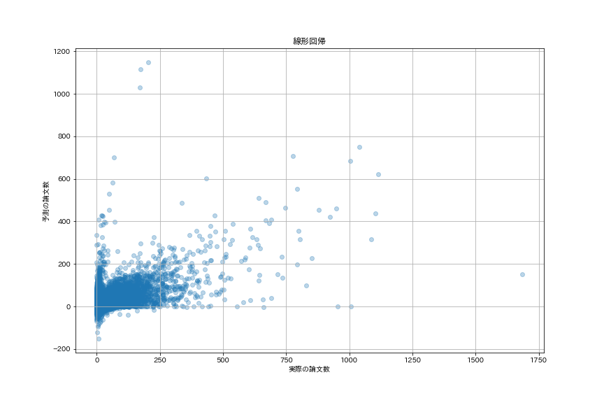
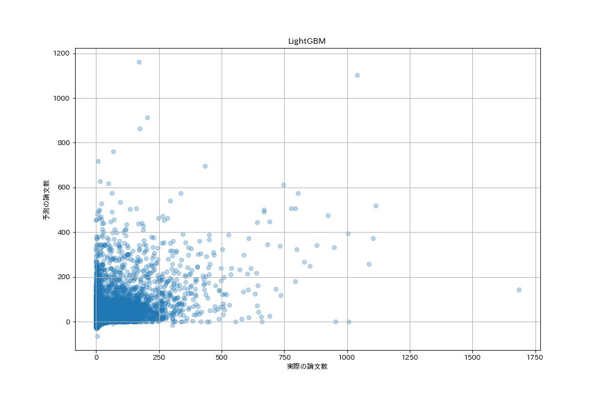
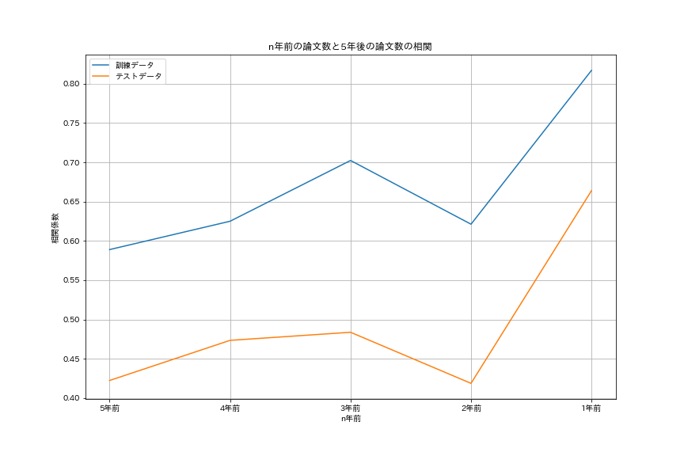
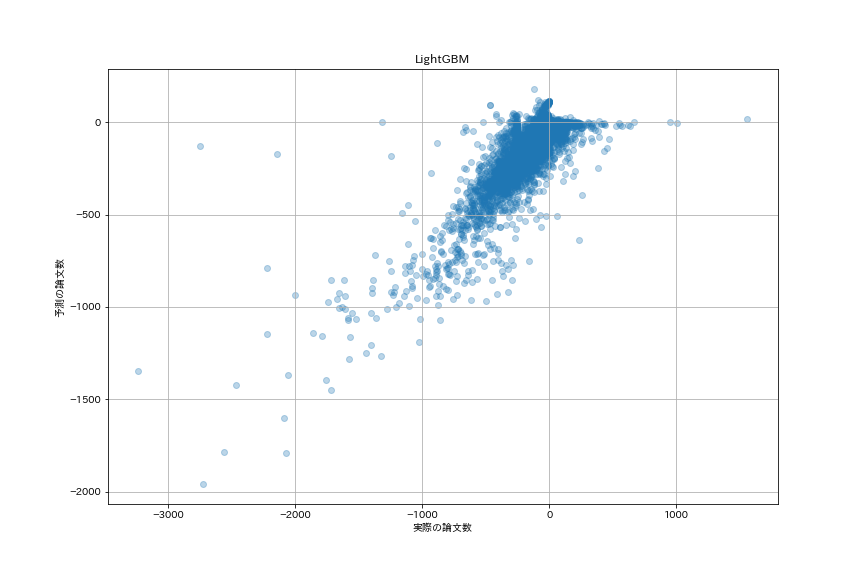

# 研究トレンド予測

これまでの論文の投稿履歴を用いて、今後の研究トピックのトレンドを予測する。研究トピックのトレンドを予測し、研究者に対して、新しい示唆を与える人工知能の作成を目標とする。

## イントロダクション

近年、論文の投稿数が増えてきていて、全ての論文に目を通すことは難しい。その結果、研究者は、狭い範囲の専門家になっていってしまっている。人工知能の期待される役割として、新しい示唆を人間に与えることにある。新しい示唆を研究者に与え、より幅広い分野であり、新規性の高い研究トピックを推薦するAIを作成したい。

## 問題設定

これまでの論文に含まれる、研究トピックを特定する。そして、二つの研究トピックがともに存在する論文があった時、その研究トピック間のエッジに重みを1追加する。このようにすることで、重み付きのグラフを作成する。そして、現在の重み付きのグラフG=(V,E)から、将来の重み付きグラフの各エッジの重みG'=(V',E')を予測する。

## 手法

### 研究トピックの特定

研究トピックは、論文のキーワードにする。2000年から2015年までの論文に含まれるキーワードの数は、6,266,923個ある。多すぎるため、出現数が2000以上の1123個のキーワードを作成した。

### 研究トピックの予測

今後の研究トピックのトレンド予測を行う。現在を2015年であるとする。　　
(学習時)2000年〜2010年の重み付きのグラフから特徴量を作成し、2010年〜2015年の重み付きのグラフのエッジ予測を行う。　　
(テスト時)2000年〜2015年の重み付きのグラフから特徴量を作成し、2015年〜2020年の重み付きのグラフのエッジ予測を行う。　　
予測手法は、NN、LightGBM(Random Forestは、実行時間orメモリの問題で処理が終わらない)、線形回帰を実行。

#### イメージ

枝の重みは、論文数を表す。リンクなし＝論文数0。  
2005年〜2010年の重み付きのグラフ  

  
2005年〜2010年の重み付きのグラフ  
  
2005年〜2010年の重み付きのグラフにおける各トピック(ノード)の特徴量に加えて、現在の論文数の推移を特徴量に入れて、2010年〜2015年の重み付きのグラフを予測する。

## 実験

今回は、Aminer(<https://www.aminer.org/citation>)で実験を行った。情報系の論文を登録しているデータセット。論文数は、5,354,309である。
訓練データの密度: 0.298, テストデータの密度: 0.0829とかなり、密度の高いグラフである。出現数が2000以上のキーワードに絞っていることが理由として考えられる。

特徴量は、参考論文で用いられていた特徴量に加えて、過去5年の二つのトピックに関する論文数を用いる。合計23次元である。

## 結果

一旦、ニューラルネットの結果は、保留。学習に時間がかかるため。追加して、LightGBM,線形回帰でもうまく予測ができてしまう。相関係数と、rank@100で評価する。precision@100では、予測値の上位100位までを選んだ時、実際の論文数が上位100位に入っている確率である。

||  線形回帰  |  LightGBM | NN |
|:---| :---: | :---: | :---: |
|相関係数|  0.536  |  0.592  | 0.4 |
|precision@100|  0.51  |  0.28  | 0.12 |
|RMSE|  12.3  |  9.02  | 10.5 |
|MSE|  152.0  |  81.4  | 110.3 |

つまり、線形回帰で予測された上位100個のトピックのペアのうち、51％のトピックは、5年後のそのトピックに関する論文数は、上位100位に属する。かなり良い予測であると感じる。

うまく予測ができる理由は次のことが関係していると考える。今後5年間に出版される各トピックのペアの論文数と、過去5年のそれぞれの論文数との相関を調べる。すると、相関係数はとても高いことがわかる。つまり、人気なテーマは、継続して高い傾向が得られる。

## 追加実験

前回までは、今後5年で発表される論文数を当てる問題にした。ここで、各トピックペアに関する論文数の変化(=今後5年で発表される論文数 - 過去5年で発表される論文数)を当てる問題にする。precision@100では、予測値の**下**位100位までを選んだ時、実際の論文数が**下**位100位に入っている確率である。

||  線形回帰  |  LightGBM | NN |
|:---| :---: | :---: | :---: |
|相関係数|  0.96  |  0.917  | 0.78 |
|precision@100|  0.86  |  0.73  | 0.62 |
|RMSE|  12.3  |  12.4  | 30.5 |
|MSE|  152.0  |  154.8  | 931.7 |

## 疑問点

- 予測がうまくいっているが、問題が簡単すぎるのか？
- 些細なこと
  - 10000 * 10000の行列計算が終わらないことがある。 → daskでなんとかするのが普通？

## 研究トレンドの推薦方法

未定
